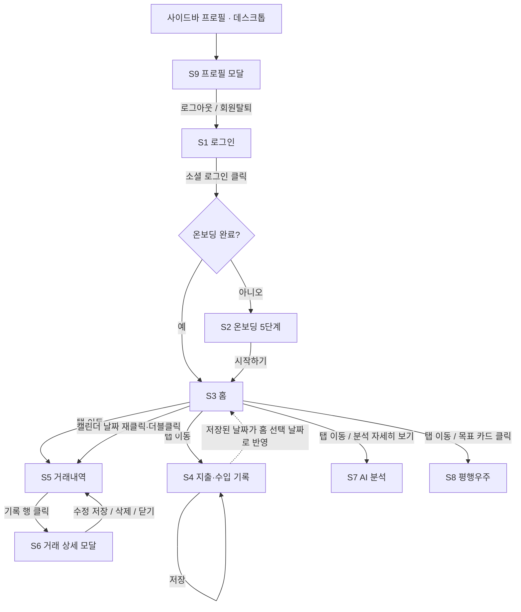

# STEP 3. 사용자 흐름 및 화면 흐름 정리

**프로젝트명:** Feelio
**작성일:** 2026-07-03
**작성 기준:** 현재 코드 기준 (`src/app/App.jsx`, `src/app/routes.js`, 각 페이지 컴포넌트). 코드에서 확인되지 않는 항목은 "추가 확인 필요" 또는 "추가 구현 필요"로 표기.

> Feelio는 사용자가 수입·지출 내역을 기록하고 각 소비에 감정을 함께 남기면, **감정에 따른 소비 패턴 분석 인사이트**를 제공하는 감정 소비 분석 서비스이다.

---

## 1. 전체 사용자 흐름

```text
소셜 로그인 (Google/Kakao/Naver)
→ 온보딩 초기 설정 (5단계 목표 설정 — 최초 1회)
→ 홈 (오늘의 감정 말랑이 · 감정 능선 · 감정 캘린더 · 목표 · AI 감정 신호)
→ 지출·수입 기록 (금액 → 감정 → 카테고리 → 상황·메모 → 저장)
→ 거래내역 (일별/월별/감정별 조회 · 검색 · 필터 → 상세/수정/삭제)
→ AI 분석 (감정 소비 패턴 분석 인사이트 확인)
→ 평행우주 (소비 습관이 만드는 두 가지 미래 비교)
```

- 한 번 온보딩을 마친 사용자의 일상 루프는 **기록 → 홈 회고 → 조회 → 인사이트 확인**이다.
- 현재 코드 기준으로 로그아웃하면 온보딩 완료 상태도 함께 초기화되어, 재로그인 시 온보딩이 다시 표시된다 (`useFeelioStoreDc.js`의 `logout`). 의도된 정책인지 확인 필요.

## 2. 주요 화면 목록

| # | 화면명 | 진입 경로 | 소스 파일 | 구현 상태 |
|---|---|---|---|---|
| S1 | 로그인 | 앱 최초 진입 / 로그아웃 후 | `src/pages/LoginPage.jsx` | 현재 화면 기준 (mock 로그인) |
| S2 | 온보딩 | 로그인 직후 (미완료 시) | `src/pages/OnboardingPage.jsx` | 현재 코드 기준 구현 |
| S3 | 홈 | 기본 탭 | `src/pages/HomePageDesign.jsx` | 현재 코드 기준 구현 |
| S4 | 지출·수입 기록 | 탭 | `src/pages/RecordPageDc.jsx` | 현재 코드 기준 구현 |
| S5 | 거래내역 | 탭 / 홈 캘린더 날짜 재클릭 | `src/pages/TransactionsPageDesign.jsx` | 현재 코드 기준 구현 |
| S6 | 거래 상세/수정 모달 | 거래내역 행 클릭 | `src/components/transactions/TransactionDetailModal.jsx` | 현재 코드 기준 구현 |
| S7 | AI 분석 | 탭 / 홈 "분석 자세히 보기" | `src/pages/AnalysisPageDc.jsx` | 현재 화면 기준 (데이터 하드코딩) |
| S8 | 평행우주 | 탭 / 홈 목표 카드 클릭 | `src/pages/UniversePageDc.jsx` | 현재 코드 기준 구현 (시나리오 고정) |
| S9 | 프로필 모달 | 사이드바 프로필 버튼 (데스크톱) | `src/components/profile/ProfileModalDc.jsx` | 현재 코드 기준 구현 |

공통 레이아웃 (`src/components/common/AppLayoutDc.jsx`):

- **데스크톱**: 좌측 고정 사이드바(로고 + 5개 탭 + 프로필 영역) + 중앙 콘텐츠. 상단 헤더에 오늘 날짜·화면 제목·다크/라이트 모드 토글.
- **모바일 (820px 이하)**: 사이드바가 숨겨지고 하단 탭바(5개 탭)로 전환. **하단 탭바에는 프로필 진입 버튼이 없음** — 9절 참고.
- 공통 배경: 오로라 색상 orb 3개 (프로필 설정의 오로라 테마에 따라 색 변경).

## 3. 화면별 역할

| 화면 | 역할 | 주요 기능 |
|---|---|---|
| 로그인 (S1) | 서비스 첫인상 전달, 계정 진입 | 감정 말랑이 히어로 슬라이드(3종 자동 전환), Google/Kakao/Naver 로그인 버튼, 다크모드 토글 |
| 온보딩 (S2) | 첫 목표를 설정해 서비스 사용의 동기 부여 | 5단계: 목표 선택 → 목표 금액 → 기간 → 현재 금액 → 요약 확인. 완료 시 대표 목표로 저장 |
| 홈 (S3) | 감정 소비 회고의 중심 화면 | 선택한 날의 대표 감정 말랑이, 월간 감정 능선(기록 5건 이상 시), 감정 색 미니 캘린더(월 이동), 대표 목표 진행률 카드, AI 감정 신호 카드. 기록이 없으면 빈 상태(물음표 말랑이·빈 능선) 표시 |
| 지출·수입 기록 (S4) | 하루의 소비를 감정과 함께 남기는 입력 화면 | 지출/수입 토글, 금액 입력, 감정 말랑이 8종 선택(필수), 카테고리 칩(필수), 상황 칩(선택·복수), 메모, 일시 지정, 저장 |
| 거래내역 (S5) | 쌓인 기록을 다양한 축으로 되돌아보는 화면 | 일별/월별/감정별 그룹 뷰, 연·월 이동, 검색(메모·카테고리), 필터(연도, 월-일, 정렬 6종, 카테고리 복수, 감정 복수), 그룹별 합계 |
| 거래 상세 모달 (S6) | 개별 기록의 확인과 관리 | 감정 말랑이·금액·상세 정보 표시, 수정(금액/카테고리/감정/상황/메모/일시), 삭제 |
| AI 분석 (S7) | 감정에 따른 소비 패턴 분석 인사이트 제공 | 위험 감정 루트, 팩트 리포트, 소비 위험도 신호등, AI 맞춤 챌린지, 카테고리별 예산 현황, 소비 코어 도넛 차트(카테고리/시간/감정 탭), 감정 인사이트 카드, 시간대별 소비 곡선 |
| 평행우주 (S8) | 소비 습관의 미래를 스토리로 체험 | "지금처럼 소비한 나" vs "감정소비를 줄인 나" 행성 선택 → 우주선 이동 연출 → 결과 내레이션(말랑이 클릭 시 문장 전환), 콘솔 레버, 이스터에그 |
| 프로필 모달 (S9) | 계정·목표·앱 설정 관리 | 프로필 변경(닉네임), 목표 관리(목록·추가), 알림 설정(UI만), 설정(다크모드, 오로라 테마, 데이터 백업 UI, 데이터 초기화), 로그아웃, 회원탈퇴(동작은 로그아웃과 동일) |

## 4. 화면 간 이동 흐름



이동 규칙 상세 (현재 코드 기준):

| 출발 | 동작 | 도착 | 비고 |
|---|---|---|---|
| 로그인 | 소셜 버튼 클릭 | 온보딩 또는 홈 | `feelio` 상태의 `onboardingDone` 여부로 분기 |
| 온보딩 5단계 | "시작하기" | 홈 | 입력한 목표가 대표 목표로 저장 |
| 모든 화면 | 사이드바/하단 탭 | 5개 탭 화면 | 홈 / 지출·수입 / 거래내역 / AI 분석 / 평행우주 |
| 홈 캘린더 | 날짜 1회 클릭 | (홈 유지) | 선택 날짜 변경 → 대표 감정 말랑이가 그 날 기준으로 갱신 |
| 홈 캘린더 | 선택된 날짜 재클릭 또는 600ms 내 더블클릭 | 거래내역 | `HomePageDesign.jsx`의 `selectDay` |
| 홈 목표 카드 | 클릭 | 평행우주 | 목표와 미래 시뮬레이션 연결 |
| 홈 AI 신호 카드 | "분석 자세히 보기" | AI 분석 | — |
| 기록 화면 | 저장 | (기록 화면 유지) | 토스트 "기록 저장됨" 표시, 입력값 초기화. 홈으로 자동 이동하지 않으며, 홈의 선택 날짜만 기록 날짜로 갱신됨 |
| 거래내역 | 행 클릭 | 거래 상세 모달 | 수정 모드 전환·삭제 가능 |
| 프로필 모달 | 로그아웃/회원탈퇴 | 로그인 | 온보딩 상태도 초기화됨 (정책 확인 필요) |

## 5. 핵심 사용 시나리오

**시나리오: 스트레스 소비를 기록하고 인사이트를 확인하는 하루**

1. 사용자가 Google 계정으로 로그인한다. (최초라면 온보딩에서 "제주도 여행 · 200만 원" 목표를 설정한다.)
2. 퇴근 후 야식을 시킨 뒤 "지출·수입 기록" 탭에서 지출 18,600원을 입력한다.
3. "이 소비, 어떤 기분이었어요?"에서 **스트레스 말랑이**를 선택하고, 카테고리 "배달", 상황 "퇴근 후"를 고른 뒤 저장한다. → "기록 저장됨" 토스트.
4. 홈으로 이동하면 오늘 날짜가 선택되어 있고, 오늘의 대표 감정으로 스트레스 말랑이가 서 있다. 캘린더의 오늘 칸이 스트레스 색으로 물든다.
5. 기록이 5건 이상 쌓인 달이라면 감정 능선에서 이번 달 가장 높이 솟은 감정을 확인한다.
6. 거래내역 탭에서 "감정별" 뷰로 전환해 스트레스 태그가 붙은 소비만 모아 본다.
7. AI 분석 탭에서 감정-소비 상관 인사이트("위험한 감정 루트", 소비 코어의 "주된 감정" 차트 등)를 확인한다.
8. 홈의 목표 카드를 눌러 평행우주로 이동, "감정소비를 줄인 나"의 미래를 보고 목표에 가까워지는 흐름을 확인한다.

## 6. 감정 기록 흐름

감정은 별도 화면이 아니라 **기록 행위 안에 내장**되어 있다.

```text
기록 화면 진입
→ 금액 입력
→ 감정 말랑이 8종 중 1개 선택 (필수 — 미선택 시 저장 버튼 비활성)
   · 선택한 감정의 색이 화면 배경 blob과 칩 강조색에 즉시 반영
   · 선택 시 나머지 말랑이는 흐려지고, 선택 말랑이는 커짐
→ 카테고리 선택 (필수)
→ 상황 칩 선택 (선택, 복수 토글 가능)
→ 메모 입력 (선택)
→ 저장 → 감정이 붙은 기록 완성
```

- 저장 후 감정 데이터가 쓰이는 곳: 홈 대표 말랑이, 감정 능선, 캘린더 날짜 색(그날 최다 감정), 거래내역 감정별 뷰·감정 필터, 거래 상세 말랑이.
- 감정 수정: 거래 상세 모달의 수정 모드에서 말랑이 8종 중 재선택 가능.
- **상황 태그:** 기록 하나에 상황을 여러 개 붙일 수 있다(복수 선택 확정, N:M). 운영 설계에서는 `transaction_situations` 조인으로 저장한다. (현재 데모 코드는 UI만 복수이고 저장 시 첫 번째 값만 유지 — 운영 전환 시 교체 대상)

## 7. 수입·지출 기록 흐름

```text
지출·수입 기록 탭
→ [지출 | 수입] 토글 선택 (기본: 지출)
→ 금액 입력 (숫자만, 자동 콤마 표시)
→ 감정 선택 (필수)
→ 카테고리 선택 (필수 — 배달/카페/교통/쇼핑/문화/건강/급여/행복)
→ 상황·메모 입력 (선택)
→ 일시 지정 (datetime-local, 기본값 존재)
→ [감정 기록 저장하기] 클릭
→ 토스트 "기록 저장됨" · 폼 초기화 · 홈 선택 날짜가 기록 날짜로 갱신
```

- 수입도 동일한 흐름으로 감정과 함께 기록된다 (예: 월급 + 뿌듯함).
- 저장 조건: 금액 + 감정 + 카테고리 3개가 모두 있어야 버튼 활성화. 미충족 시 버튼에 "금액·감정·카테고리를 골라주세요" 안내.
- **주의 (현재 코드 기준):** 일시 기본값이 `2026-07-01T21:30`으로 고정되어 있음 — 데모용 값으로 추정, 실제 서비스에서는 현재 시각으로 교체 필요.
- 기록 수정·삭제는 거래내역 → 상세 모달에서 수행한다.

## 8. 조회 및 분석 흐름

### 8-1. 조회 (거래내역)

```text
거래내역 탭
→ 상단에서 연·월 이동 (‹ 2026년 7월 ›)
→ 보기 축 선택: [일별] [월별] [감정별]
→ (선택) 검색어 입력 — 메모·카테고리 대상
→ (선택) 필터 열기 — 연도 / 월-일 / 정렬 6종 / 카테고리 복수 / 감정 복수
→ 그룹 헤더에서 그룹별 합계(수입-지출) 확인
→ 기록 행 클릭 → 상세 모달 → 수정 또는 삭제
```

### 8-2. 홈 회고

```text
홈 진입
→ 캘린더에서 날짜 선택 → 그 날의 대표 감정 말랑이 확인
→ 감정 능선에서 이번 달 감정 분포 확인 (감정 기록 5건 이상일 때)
→ AI 감정 신호 카드에서 이번 달 감정 변화 요약 확인
```

### 8-3. 분석 (AI 분석 · 평행우주)

```text
AI 분석 탭
→ 위험 감정 루트 · 팩트 리포트 · 소비 위험도 · AI 챌린지 (상단 KPI 카드 4종)
→ 카테고리별 예산 현황 (감정 태그가 붙은 진행 바)
→ 소비 코어 도넛 차트 — [가장 많이 쓴 곳 | 주로 쓴 시간 | 주된 감정] 탭 전환
→ 감정 인사이트 카드 · 시간대별 소비 곡선

평행우주 탭
→ 두 행성(현재 우주 / 다른 우주) 중 선택
→ 우주선 이동 연출 (약 1.2초)
→ 결과 패널: 감정소비 금액·내레이션·목표 영향 확인
→ 말랑이 클릭 시 내레이션 문장 전환, 다른 행성 재선택 가능
```

- **주의:** AI 분석 화면의 모든 수치·문구와 평행우주 시나리오는 현재 하드코딩 데이터다. 실제 기록 기반 집계·시뮬레이션은 추가 구현 필요. 분석 화면 상단에 남아 있는 누수율 KPI 배지는 제거 확정 기능의 잔여 UI로, 제거 예정.

## 9. 현재 구현 화면과 추가 필요 화면 구분

### 구현된 화면 (현재 코드 기준)

| 화면 | 상태 | 비고 |
|---|---|---|
| 로그인 | UI 완성 | 실제 OAuth 연동은 추가 구현 필요 (현재 버튼 클릭 시 즉시 로그인) |
| 온보딩 | 동작 | 3단계(기간 선택)는 선택값이 저장되지 않음 — 확인 필요 |
| 홈 | 동작 | 빈 상태/데이터 상태 분기 포함. AI 감정 신호 문구는 하드코딩 |
| 지출·수입 기록 | 동작 | 일시 기본값 고정, 상황 복수 저장 정책 미확정 |
| 거래내역 + 상세 모달 | 동작 | 기록이 하나도 없으면 목데이터를 대신 표시 (`state.transactions.length ? ... : mockTransactions`) — 데모용 처리로 추정, 정책 확인 필요 |
| AI 분석 | UI 완성 | 데이터 전부 하드코딩. 누수율 잔여 UI 제거 예정 |
| 평행우주 | 동작 | 시나리오 데이터 고정 |
| 프로필 모달 | 동작 | 알림 설정·데이터 백업은 UI만 존재 |

### 추가 필요 화면 / 진입 경로

| 항목 | 필요성 | 분류 |
|---|---|---|
| 모바일 프로필 진입 경로 | 820px 이하에서 사이드바가 숨겨지는데 하단 탭바에 프로필 버튼이 없어 프로필 모달에 접근할 수 없음 | 추가 구현 필요 |
| 실제 OAuth 동의/콜백 처리 | 소셜 로그인 실연동 시 필요 | 추가 구현 필요 |
| 온보딩 재진입/목표 재설정 흐름 | 로그아웃 시 온보딩이 초기화되는 현재 동작의 정책 확정 필요 | 확인 필요 |
| 알림 설정·데이터 백업 실동작 | 현재 UI만 존재 | 후순위 |
| 거래내역 빈 상태 화면 | 기록 0건일 때 목데이터 대체 표시를 유지할지, 빈 상태 안내를 만들지 결정 필요 | 확인 필요 |
