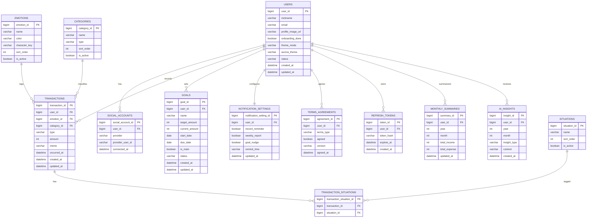

# STEP 6. ERD

**프로젝트명:** Feelio
**작성일:** 2026-07-06
**작성 기준:** 본 ERD는 현재 데모 코드에서 동작하는 범위가 아니라 **실제 운영 서비스로 런칭하는 것을 전제로** 설계한다. 현재 프론트 데이터 구조(`src/`)와 STEP 1~5의 서비스 방향·정책을 기반으로 하되, 실서비스에 필요한 인증·코드·분석·운영 테이블까지 포함한다.
**목표 DBMS:** MySQL 8.x (Spring Boot + MyBatis)

**반영된 확정 방향 (STEP 1~5 + 운영 설계 결정):**

- 감정·카테고리·상황은 **코드(마스터) 테이블로 분리**하고 기록은 FK로 참조 — 무결성 보장, 색상·정렬 등 메타데이터를 서버가 관리
- **상황(situation)은 복수 선택(N:M)** — `transaction_situations` 조인 테이블 사용
- 감정·카테고리는 기록당 **단일 선택(FK 1개)**, 감정은 필수
- 소셜 로그인은 `social_accounts`로 분리해 **한 사용자가 여러 소셜 계정 연결** 가능
- 온보딩 완료 상태는 계정 기준 서버 보존, 소셜 **프로필 이미지 URL** 보유
- 분석은 실시간 집계 + `monthly_summaries`(캐시)·`ai_insights`(생성 문장 저장)
- 운영: 알림 설정·약관 동의 이력·리프레시 토큰 포함
- 누수율 관련 컬럼·테이블 없음 (제거 확정), 커스텀 태그(tags/expense_tags)·monthly_analyses 구조는 폐기

---

## 1. 테이블 목록 (총 12개)

### 핵심 도메인 (4)

| 테이블 | 설명 |
|---|---|
| `users` | 사용자 계정·프로필·앱 설정·온보딩 상태 |
| `social_accounts` | 소셜 로그인 연결 정보 (users와 1:N, 다중 소셜 연결 대비) |
| `transactions` | 감정·카테고리가 붙는 수입·지출 기록 (서비스 핵심) |
| `goals` | 사용자 목표 (대표 목표 포함) |

### 코드/마스터 (3)

| 테이블 | 설명 |
|---|---|
| `emotions` | 감정 마스터 (기본 8종, 색상·정렬 등 메타) |
| `categories` | 카테고리 마스터 (지출/수입 구분, 정렬) |
| `situations` | 상황 마스터 (정렬) |

### 연결 (1)

| 테이블 | 설명 |
|---|---|
| `transaction_situations` | 기록–상황 N:M 조인 |

### 분석 (2)

| 테이블 | 설명 |
|---|---|
| `monthly_summaries` | 월별 집계 캐시 (홈·분석 성능용) |
| `ai_insights` | 감정 소비 인사이트/AI 생성 문장 저장 |

### 운영 (3)

| 테이블 | 설명 |
|---|---|
| `notification_settings` | 사용자 알림 설정 |
| `terms_agreements` | 약관·개인정보 동의 이력 (실서비스 법적 필수) |
| `refresh_tokens` | JWT 리프레시 토큰 |

## 2. ERD

Mermaid Live Editor에 그대로 붙여넣어 렌더링할 수 있는 형태다 (속성 주석 없음, 테이블명 영어). 컬럼 상세는 STEP 7 데이터베이스 설계서를 참조한다.

## 3. PK / FK / 주요 제약

| 테이블 | PK | FK | 고유 제약 | 주요 제약 |
|---|---|---|---|---|
| users | user_id | — | — | status ∈ {ACTIVE, WITHDRAWN} |
| social_accounts | social_account_id | user_id → users | `(provider, provider_user_id)` UNIQUE | provider ∈ {GOOGLE, KAKAO, NAVER} |
| transactions | transaction_id | user_id → users, emotion_id → emotions, category_id → categories | — | type ∈ {EXPENSE, INCOME}, amount > 0, emotion_id·category_id NOT NULL |
| goals | goal_id | user_id → users | — | 사용자당 is_main = 1 최대 1건, target_amount > 0 |
| emotions | emotion_id | — | `name` UNIQUE | — |
| categories | category_id | — | `(name, type)` UNIQUE | type ∈ {EXPENSE, INCOME} |
| situations | situation_id | — | `name` UNIQUE | — |
| transaction_situations | transaction_situation_id | transaction_id → transactions, situation_id → situations | `(transaction_id, situation_id)` UNIQUE | — |
| monthly_summaries | summary_id | user_id → users | `(user_id, year, month)` UNIQUE | — |
| ai_insights | insight_id | user_id → users | — | insight_type ∈ {HOME, MONTHLY, WARNING 등} |
| notification_settings | notification_setting_id | user_id → users | `user_id` UNIQUE (1:1) | — |
| terms_agreements | agreement_id | user_id → users | — | terms_type ∈ {SERVICE, PRIVACY, MARKETING} |
| refresh_tokens | token_id | user_id → users | `token_hash` UNIQUE | — |

- 사용자 하위 테이블의 FK는 **ON DELETE CASCADE** (탈퇴 시 개인 데이터 삭제). 단 마스터 테이블(emotions/categories/situations)은 참조 무결성상 삭제 대신 `is_active=false`로 비활성.
- `transactions.emotion_id`/`category_id`는 마스터 참조라 **ON DELETE RESTRICT** (사용 중인 코드 값 삭제 방지).

## 4. 관계 설명

| 관계 | 카디널리티 | 설명 |
|---|---|---|
| users — social_accounts | 1 : N | 한 사용자가 여러 소셜 계정(Google·Kakao 등)을 연결할 수 있다. 로그인 시 `(provider, provider_user_id)`로 계정을 찾고, 없으면 신규 users + social_accounts 생성 |
| users — transactions | 1 : N | 한 사용자가 여러 기록을 가진다. 모든 조회는 인증 주체의 user_id로 격리 (REQ-N-005) |
| users — goals | 1 : N | 여러 목표 중 `is_main` 1건이 대표 목표 |
| users — notification_settings | 1 : 1 | 사용자당 알림 설정 1행 (가입 시 기본값 생성) |
| users — terms_agreements | 1 : N | 약관 유형별·버전별 동의 이력을 누적 저장 |
| users — refresh_tokens | 1 : N | 기기·세션별 리프레시 토큰 |
| users — monthly_summaries | 1 : N | 사용자·연·월 단위 집계 캐시 |
| users — ai_insights | 1 : N | 사용자에게 생성된 인사이트 이력 |
| emotions — transactions | 1 : N | 기록 1건은 감정 1개를 필수 참조 (`emotion_id`) |
| categories — transactions | 1 : N | 기록 1건은 카테고리 1개를 필수 참조 (`category_id`) |
| transactions — situations | **N : M** | 기록 1건에 상황 여러 개(예: 퇴근 후 + 혼자 있음). `transaction_situations` 조인으로 표현. 상황은 선택이므로 0개도 가능 |

## 5. 감정 능선·분포와 마스터 테이블의 관계

- 홈의 대표 감정·감정 능선·감정 캘린더, 거래내역 감정별 조회는 모두 `transactions.emotion_id`를 `emotions`와 조인해 산출한다.
- 감정 색상(`emotions.color`)·캐릭터 키(`character_key`)·정렬(`sort_order`)을 서버가 내려주므로, 프론트 팔레트 하드코딩을 서버 기준으로 통일할 수 있다 (현재 `src/data/emotions.js`의 역할을 마스터 테이블이 대체).
- 감정 능선은 8종 전체를 축으로 사용한다 (정책 #4). `emotions.sort_order`가 능선·범례의 표시 순서를 결정한다.

## 6. 초기 시드 데이터 (마스터 테이블)

| 테이블 | 시드 |
|---|---|
| emotions | 신남, 설렘, 뿌듯함, 스트레스, 외로움, 화남, 평온, 무덤덤 (각 color·character_key·sort_order) |
| categories (EXPENSE) | 식비, 배달, 카페, 교통, 쇼핑, 문화, 건강, 기타 |
| categories (INCOME) | 급여, 용돈, 기타 |
| situations | 퇴근 후, 혼자 있음, 친구와, 보상, 습관, 이동 중, 아침, 밤 |

> 카테고리 목록은 화면 간 불일치가 있어 위 시드로 확정 제안한다 (STEP 7 5절, 팀 확인 필요). '행복' 카테고리는 성격 불명확으로 제외.

## 7. 향후 확장 여지 (본 ERD에 미포함)

실서비스 로드맵상 더 큰 기능이 확정되면 추가할 수 있는 테이블. 현재 서비스 정의 범위 밖이라 포함하지 않는다.

| 제안 테이블 | 용도 | 채택 시점 |
|---|---|---|
| `challenges` / `challenge_progress` | AI 맞춤 챌린지(4순위) 실구현 | 챌린지 기능 확정 시 |
| `budgets` | 카테고리별 예산 한도 관리 | 분석 화면의 예산 기능을 실데이터화할 때 |
| `attachments` | 영수증 이미지 등 첨부 | 이미지 기록 기능 도입 시 |

> 초기 기획의 `tags`/`expense_tags`(커스텀 태그)와 `monthly_analyses`(누수율)는 재사용하지 않는다 — 범위 제외·제거 확정 결정과 충돌한다. 커스텀 감정·상황을 허용하게 되면 마스터 테이블에 `user_id`(소유자, 기본 태그는 NULL) 컬럼을 추가해 확장한다.

## 8. 프론트 상태 ↔ 테이블 매핑 (연동 시 참조)

| 프론트 (localStorage) | DB | 비고 |
|---|---|---|
| `state.user.nickname / provider` | `users.nickname` / `social_accounts.provider` | provider는 소셜 계정 테이블로 이동 |
| (신규) 프로필 이미지 | `users.profile_image_url` | OAuth 수신 |
| `state.onboardingDone` | `users.onboarding_done` | 로그아웃해도 보존 |
| `state.mode / aurora` | `users.theme_mode / aurora_theme` | 서버 저장 시 기기 간 동기화 |
| `transactions[].emotion` (문자열) | `transactions.emotion_id` → `emotions.name` | 문자열 → FK 전환 |
| `transactions[].category` (문자열) | `transactions.category_id` → `categories.name` | 문자열 → FK 전환 |
| `transactions[].situation` (단일 문자열) | `transaction_situations` (복수 행) | 단일 → N:M 전환 |
| `transactions[].date` | `transactions.occurred_at` | 발생 일시 |
| `goals[].name / target / current / due` | `goals.name / target_amount / current_amount / due_date` | — |
| goals[0] = 대표 (암묵) | `goals.is_main` | 명시 컬럼 |
