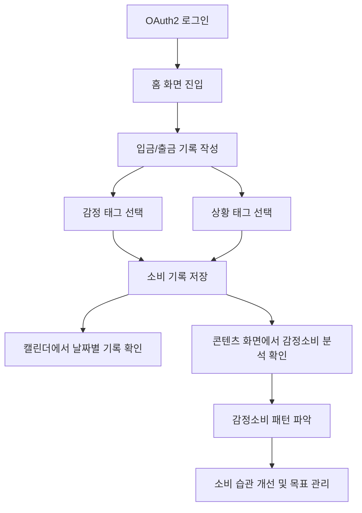

# Feelio

> **돈의 흐름보다, 소비 뒤에 숨어 있는 감정의 흐름을 분석합니다.**

**Feelio**는 사용자가 소비 순간의 감정과 상황을 함께 기록하고, 누적된 데이터를 바탕으로 개인의 소비 행동을 해석하는 **감정 기반 소비 인사이트 서비스**입니다.

단순히 얼마를 썼는지 기록하는 것을 넘어, 사용자가 어떤 감정 상태에서 어떤 소비를 반복하는지 확인하고 더 나은 소비 습관과 자산관리 방향으로 이어질 수 있도록 돕습니다.

<br />

## Feeling Input, Insight Output

소비는 단순히 돈을 사용한 결과만으로 설명되지 않습니다.  
같은 소비라도 어떤 날은 필요에 의한 선택이고, 어떤 날은 외로움, 스트레스, 신남, 보상심리처럼 감정에서 비롯된 행동일 수 있습니다.

Feelio는 소비 기록에 감정과 상황을 함께 연결하여 사용자가 자신의 소비를 **감정과 연결된 행동 패턴**으로 이해할 수 있도록 합니다.

<br />

## Why Feelio?

일반적인 소비 기록 서비스는 금액과 카테고리를 중심으로 소비를 정리합니다.  
하지만 사용자는 소비 후 금액은 확인할 수 있어도, 그 소비가 어떤 감정에서 시작되었고 어떤 상황에서 반복되는지는 쉽게 파악하기 어렵습니다.

Feelio는 이 문제를 다음과 같이 바라봅니다.

| 문제 | Feelio의 접근 |
|---|---|
| 소비 원인을 알기 어렵다 | 소비 당시의 감정과 상황을 함께 기록합니다. |
| 반복 소비를 인식하기 어렵다 | 감정, 상황, 시간대별 반복 패턴을 분석합니다. |
| 기존 기록 방식은 금액 중심이다 | 소비를 의사결정의 맥락으로 해석합니다. |
| 소비 조절이 어렵다 | 감정소비 누수율과 맞춤형 피드백을 제공합니다. |

<br />

## Core Experience

### 1. 감정과 함께 소비 기록

사용자는 입금과 출금 기록을 남길 때 금액, 메모, 분류 태그뿐 아니라 감정 태그와 상황 태그를 함께 기록합니다.

예시 감정 태그:

```text
외로움 · 신남 · 불안 · 평온 · 스트레스 · 뿌듯함 · 화남 · 무덤덤
```

예시 상황 태그:

```text
퇴근 후 · 새벽 · 혼자 있음 · 보상소비 · 월급날 · 충동소비
```

<br />

### 2. 감정소비 패턴 분석

누적된 기록을 바탕으로 사용자가 어떤 감정 상태에서 어떤 소비를 반복하는지 분석합니다.

예를 들어 단순히 “배달 지출이 많다”고 보여주는 것이 아니라,

> **외로운 새벽 시간대에 배달 소비가 반복되고 있어요.**

처럼 소비의 원인과 흐름을 함께 보여줍니다.

<br />

### 3. 감정소비 누수율 제공

Feelio는 사용자의 전체 소비 중 감정과 강하게 연결된 소비 비중을 **감정소비 누수율**로 표현합니다.

```text
감정소비 누수율 = 감정소비 금액 / 총 출금 금액 × 100
```

이를 통해 사용자는 감정에 의해 반복되는 소비의 비중을 직관적으로 확인할 수 있습니다.

<br />

### 4. 소비 인사이트와 자산관리 연결

Feelio는 단순한 지출 기록에서 끝나지 않고, 사용자가 반복되는 감정소비를 인식하고 개선할 수 있도록 맞춤형 피드백을 제공합니다.

이를 통해 소비의 주도권을 회복하고 더 나은 자산관리 습관으로 이어지는 경험을 제공합니다.

<br />

## Main Features

| 기능 | 설명 |
|---|---|
| OAuth2 로그인 | 사용자가 간편하게 서비스에 접근할 수 있도록 OAuth2 기반 로그인 제공 |
| 입금/출금 기록 | 금액, 메모, 날짜, 거래 유형을 기록 |
| 감정 태그 기록 | 소비 당시의 감정 상태를 태그로 저장 |
| 상황 태그 기록 | 소비가 발생한 시간대와 상황을 함께 저장 |
| 캘린더 기록 조회 | 날짜별 소비 기록과 감정 흐름 확인 |
| 감정소비 분석 | 감정별, 상황별, 시간대별 소비 패턴 분석 |
| 감정소비 누수율 | 감정과 연결된 소비 비중을 시각화 |
| 목표 관리 | 소비 개선 경험을 개인 자산관리 목표와 연결 |

<br />

## Service Flow



<br />

## Project Direction

Feelio는 한 달간 진행되는 3인 팀 프로젝트로, 기능을 과도하게 확장하기보다 **핵심 경험의 완성도**를 우선합니다.

### MVP Goal

> 사용자가 감정소비를 기록하고, 반복 패턴을 인식하며, 소비 개선 방향을 확인할 수 있는 웹 서비스 구현

<br />

## Expansion Plan

| 단계 | 확장 방향 | 설명 |
|---|---|---|
| 1단계 | 웹 MVP 구현 | 소비 순간의 감정과 상황을 직접 기록하는 기본 서비스 구현 |
| 2단계 | 분석 고도화 | 감정별, 상황별, 시간대별 소비 패턴 분석 강화 |
| 3단계 | 목표 연결 | 감정소비 개선 경험을 개인 자산관리 목표와 연결 |
| 4단계 | 기록 자동화 | Android 알림 감지, MyData, 금융 API 연동 가능성 확보 |

<br />

## Tech Stack

> 프로젝트 진행 상황에 따라 변경될 수 있습니다.

### Frontend

```text
React · JavaScript · CSS · Axios · TanStack Query
```

### Backend

```text
Spring Boot · Java · Spring Security · OAuth2 · JWT · MyBatis
```

### Database

```text
MySQL
```

### Collaboration

```text
GitHub Issues · Branch Strategy · Pull Request · Notion / Docs
```

<br />

## Team

| 역할 | 담당 |
|---|---|
| Frontend | UI 구현, 화면 플로우, API 연동 |
| Backend | 인증, API, DB 설계, 서버 로직 |
| Planning / Design | 서비스 기획, UX 설계, 문서화, 테스트 |

<br />

## Final Message

Feelio는 소비 내역을 정리하는 서비스가 아닙니다.  
소비 뒤에 숨어 있는 감정의 흐름을 발견하고, 사용자가 소비의 주도권을 회복하도록 돕는 **감정 기반 소비 인사이트 서비스**입니다.
