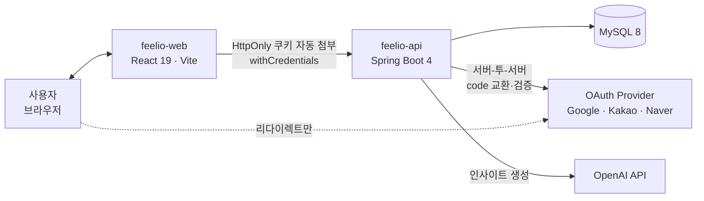
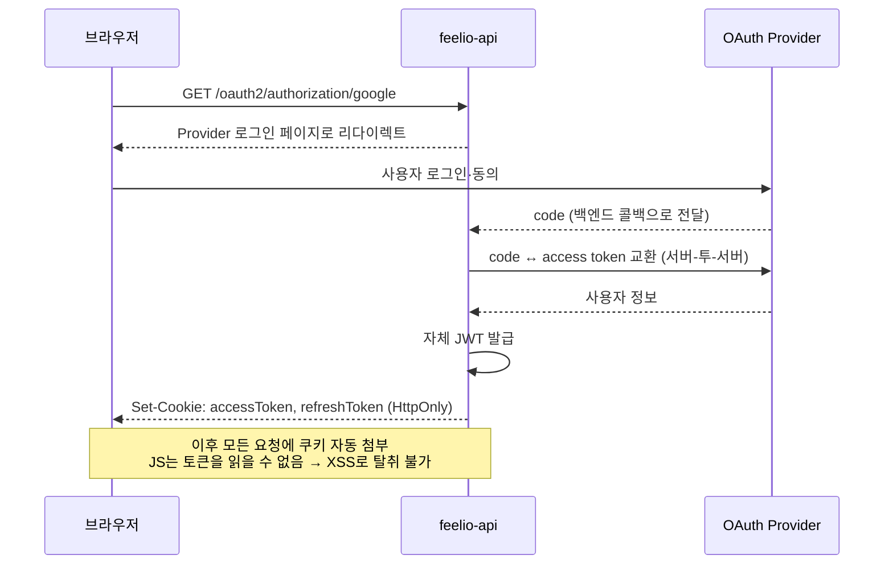

<div align="center">

# Feelio

### 돈의 흐름보다, 소비 뒤에 숨어 있는 감정의 흐름을 분석합니다

**Feeling Input, Insight Output** — 소비 순간의 감정을 함께 기록하고,
누적된 데이터로 개인의 소비 행동을 해석하는 **감정 기반 소비 인사이트 서비스**입니다.

[FRONT](https://github.com/feelios/feelio-web) · [BACK](https://github.com/feelios/feelio-api)

</div>

---

## 목차

- [서비스 소개](#서비스-소개)
- [화면](#화면)
- [팀원](#팀원)
- [기술 스택](#기술-스택)
- [로컬 실행 방법](#로컬-실행-방법)
- [시스템 구조](#시스템-구조)
- [데이터베이스 설계](#데이터베이스-설계)
- [API 명세](#api-명세)
- [화면 구현 및 코드 리뷰](#화면-구현-및-코드-리뷰)
- [협업 방식](#협업-방식)
- [프로젝트 일정](#프로젝트-일정)
- [트러블슈팅](#트러블슈팅)
- [회고](#회고)

---

## 서비스 소개

Feelio는 사용자가 **소비 순간의 감정을 함께 기록**하고, 누적된 데이터를 바탕으로
개인의 소비 행동을 해석하는 **감정 기반 소비 인사이트 서비스**입니다.

단순히 얼마를 썼는지 기록하는 것을 넘어, 사용자가 **어떤 감정 상태에서 어떤 소비를 반복하는지**
확인하고 더 나은 소비 습관과 자산관리 방향으로 이어질 수 있도록 돕습니다.

### Feeling Input, Insight Output

소비는 단순히 돈을 사용한 결과만으로 설명되지 않습니다.
같은 소비라도 어떤 날은 필요에 의한 선택이고, 어떤 날은
**외로움·스트레스·신남·보상심리처럼 감정에서 비롯된 행동**일 수 있습니다.

Feelio는 소비 기록에 감정을 함께 연결하여,
사용자가 자신의 소비를 **감정과 연결된 행동 패턴**으로 이해할 수 있도록 합니다.

> *"외로운 밤마다 배달 소비가 반복되고 있어요."*

### Why Feelio?

일반적인 소비 기록 서비스는 금액과 카테고리를 중심으로 소비를 정리합니다.
하지만 사용자는 소비 후 금액은 확인할 수 있어도, **그 소비가 어떤 감정에서 시작되었고
어떤 맥락에서 반복되는지**는 쉽게 파악하기 어렵습니다.

| 문제 | Feelio의 접근 |
|---|---|
| 소비 원인을 알기 어렵다 | 소비 당시의 **감정**을 함께 기록합니다 |
| 반복 소비를 인식하기 어렵다 | **감정 · 카테고리 · 시간대별 반복 패턴**을 분석합니다 |
| 기존 기록 방식은 금액 중심이다 | 소비를 **의사결정의 맥락**으로 해석합니다 |
| 소비 조절이 어렵다 | **AI 인사이트**와 **평행우주 시뮬레이션**으로 피드백합니다 |

### 설계 원칙

| 원칙 | 의미 |
|---|---|
| **평가하지 않는다** | 수치로 압박하는 회계 도구가 아니라, 가볍고 감성적인 회고 경험을 지향합니다 |
| **감정의 언어로 돌려준다** | 숫자·표 대신 **감정 말랑이 캐릭터**, **감정 색 캘린더**, **월간 감정 능선**으로 보여줍니다 |
| **목표와 연결한다** | 감정소비를 줄이면 가까워지는 **평행우주의 다른 미래**를 시뮬레이션으로 체험하게 합니다 |

### 감정 8종

`신남` `설렘` `뿌듯함` `스트레스` `외로움` `화남` `평온` `무덤덤`

### 핵심 사용자 루프

```text
기록          금액 + 감정 1종 + 카테고리 + 메모
  ↓
홈 회고        대표 감정 말랑이 · 감정 색 캘린더 · 월간 감정 능선
  ↓
조회          일별 / 월별 / 감정별 거래내역
  ↓
인사이트       AI 분석 · 평행우주 미래 비교
  ↓
목표          온보딩에서 설정한 목표와 소비 흐름 연결
```

### 의도적으로 만들지 않은 것

범위를 지키는 것도 설계라고 생각했습니다. 아래는 **명시적으로 제외**한 기능입니다.

- 이메일/비밀번호 회원가입 — 소셜 로그인 전용 (Google / Kakao / Naver)
- MyData·카드/계좌 자동 연동 — 직접 기록 방식만
- 커스텀 감정 생성 — 감정 8종 고정
- 친구 챌린지, 챗봇 상담, 관리자 기능

---

## 화면

| 화면 | 설명 |
|---|---|
| **기록** | 금액을 넣고 그 순간의 감정을 고른다 |
| **홈 회고** | 대표 감정 말랑이와 감정 색 캘린더, 월간 감정 능선 |
| **거래내역** | 일별·월별·감정별로 되돌아본다 |
| **AI 분석** | 반복되는 감정-소비 패턴 리포트 |
| **평행우주** | 목표까지 남은 거리를 시뮬레이션 |
| **온보딩** | 목표를 정하고 시작한다 |

<!--
  ▼ GIF/스크린샷 준비되면 위 표를 지우고 아래 주석을 해제한다.
  권장: 각 화면 1개씩, 폭 240px 내외, 실제 조작이 보이는 짧은 GIF(3~5초).
  이미지는 이 레포의 profile/images/ 에 커밋하고 아래 경로를 그에 맞게 쓴다.

| 기록 | 홈 회고 | 거래내역 |
|:---:|:---:|:---:|
|  |  |  |
| 금액을 넣고 그 순간의 감정을 고른다 | 대표 감정 말랑이와 감정 색 캘린더 | 일별·월별·감정별로 되돌아본다 |

| AI 분석 | 평행우주 | 온보딩 |
|:---:|:---:|:---:|
|  |  |  |
| 반복되는 감정-소비 패턴 리포트 | 목표까지 남은 거리를 시뮬레이션 | 목표를 정하고 시작한다 |
-->

---

## 팀원

<table>
<tr>
<td align="center" width="33%"><br/><b>권민주</b> <sub>팀장</sub><br/><a href="https://github.com/BeautifulSoup35">@BeautifulSoup35</a></td>
<td align="center" width="33%"><br/><b>김은채</b><br/><a href="https://github.com/olvchae">@olvchae</a></td>
<td align="center" width="33%"><br/><b>노푸른</b><br/><a href="https://github.com/edoal1999-oss">@edoal1999-oss</a></td>
</tr>
</table>

### 권민주 <sub>팀장</sub>

- **거래 기록 · 거래내역** — 화면 구현 및 CSS, `/api/transactions` CRUD, 동적 조회 SQL, 일괄 삭제
- **홈 회고 집계 · 반복 패턴 분석** — 감정 색 캘린더 집계, 패턴 집계 쿼리·이벤트 기반 비동기 재분석·캐싱
- **분석 API** — AI 인사이트, 예산 현황, 지출 추이, 과거 달 조회 (`/api/analysis`)
- **인증** — OAuth2 BFF 패턴 구현, Stateless 세션 충돌 해결, 로그아웃·토큰 재발급
- **카테고리** — 커스텀 추가·순서 변경 API, 스키마 통합 마이그레이션(FK 복구)
- **프론트엔드 공통 기반** — axios 인스턴스, 인증 인터셉터, 데이터 페칭 구조, 화면 간 연결 로직
- **FCM 푸시 알림** — 서버 연동 및 딥링크
- **이슈 트래커 운영 · 발표 자료 제작 및 발표**

### 김은채

- **프로젝트 기획 총괄** — 아이템 정의, 요구사항·기능명세, 화면 흐름 설계
- **디자인 전반** — 말랑이 캐릭터, 감정 8색 팔레트, HTML 프로토타입, `DESIGN-GUIDE.md` 동결
- **백엔드 공통 기반** — 도메인형 패키지 구조, 공통 응답 봉투, 전역 예외 처리, Security 설정, DB 스키마
- **인증** — 소셜 로그인, Security JWT 발급, 리프레시 토큰 동시 재발급 경쟁 조건 해결
- **AI 문구 생성** — 페르소나 3종(팩트 폭격기·감정 상담사·맞춤 챌린지), 타임아웃·서킷 브레이커·폴백 방어
- **평행우주** — 시뮬레이션 화면 및 API, GPT 서술 생성 (`/api/universe`)
- **사용자 · 마스터 · 목표 API** — 온보딩, 설정, 회원 탈퇴
- **홈 회고 화면 · 모바일 반응형 · CI 파이프라인** — 말랑이·감정 캘린더 UI, 반응형 최적화, PR 검증 게이트

### 노푸른

- **온보딩** — 목표 설정 플로우, 초기 자산·마감일 처리
- **목표 화면** — CRUD 연동
- **회원 설정** — 테마 변경, 탈퇴 후 재가입 복구
- **기록 화면 연동** — 지출·수입 기록 연동 및 캐시 무효화
- **모바일 · 폰트** — 평행우주 UI 개선, 공통 레이아웃 여백 수정, 글로벌 폰트 통일

### 공동 작업

AI 프롬프트 설계·개선 · AI 분석 화면 구현 · 목표 달성액 산출·동기화 · 공통 컴포넌트(레이아웃·사이드바·날짜 피커·모달)

> <sub>도메인은 위와 같이 나눴지만 공통 기반과 인증·AI처럼 여러 도메인이 함께 쓰는 부분은 먼저 만들어 두고
> 그 위에 각자의 기능을 붙였고, 화면 완성도는 이후 세 명이 함께 다듬었습니다.</sub>

---

## 기술 스택

### FrontEnd


### BackEnd


### 외부 연동


### 형상 관리 · 배포


---

## 프로젝트 구조

프론트엔드와 백엔드를 **두 개의 레포**로 나눠 관리합니다.

```text
feelios/
├── feelio-web     React 19 · Vite 8
└── feelio-api     Spring Boot 4 · MyBatis · MySQL 8
```

### feelio-web

```text
src/
├── app/
│   ├── App.jsx                    # 최상위 · 화면 전환
│   └── routes.js                  # 탭 정의 (홈·기록·거래내역·AI분석·평행우주)
├── pages/                         # 화면 단위
│   ├── HomePageDesign.jsx           홈 회고 — 말랑이·감정 색 캘린더·감정 능선
│   ├── RecordPageDc.jsx             기록 — 금액 + 감정 + 카테고리
│   ├── TransactionsPageDesign.jsx   거래내역 — 일별·월별·감정별
│   ├── AnalysisPageDc.jsx           AI 분석
│   ├── UniversePageDc.jsx           평행우주 시뮬레이션
│   ├── OnboardingPage.jsx           온보딩 — 목표 설정
│   └── LoginPage.jsx                소셜 로그인
├── components/                    # 재사용 컴포넌트
│   ├── common/                      레이아웃·사이드바·날짜 피커·말랑이(EmotionBlob)
│   ├── analysis/  transactions/  universe/  profile/
├── api/                           # axios 인스턴스 + 도메인별 호출 함수
├── hooks/queries/                 # TanStack Query 훅 (도메인별)
├── stores/                        # Zustand 스토어
├── styles/                        # 전역 스타일 · 감정 팔레트(theme.js)
├── constants/  utils/  data/
└── main.jsx
```

### feelio-api

**도메인형 패키지 구조**입니다. 한 도메인 안에 컨트롤러부터 SQL 매퍼까지 모여 있습니다.

```text
src/main/java/com/korit/feelioapi/
├── domain/
│   ├── auth/            소셜 로그인, JWT 발급·재발급
│   ├── user/            내 정보, 온보딩, 설정, 탈퇴
│   ├── transaction/     기록 CRUD, 일괄 삭제, 반복 소비 패턴
│   ├── summary/         홈 집계 — 감정 색 캘린더·감정 능선·말랑이 코멘트
│   ├── analysis/        월간 분석, AI 인사이트·리포트
│   ├── universe/        평행우주 시뮬레이션
│   ├── goal/            목표
│   ├── category/        카테고리·커스텀·순서
│   └── meta/            감정·카테고리 마스터
│       ├── controller/    얇게 유지 — 요청 검증과 위임만
│       ├── service/       비즈니스 로직, @Transactional
│       ├── mapper/        @Mapper 인터페이스 (순수 데이터 접근)
│       ├── dto/           요청·응답 DTO
│       └── entity/        DB 행 매핑 POJO (JPA 아님)
└── global/              공통 설정, 예외 처리, 응답 포맷, 시큐리티, AI

src/main/resources/
├── mapper/              SQL XML (도메인별)
├── application.yaml     커밋 대상 — 플레이스홀더만
└── application-secret.yaml   gitignore — 실제 비밀값
```

---

## 로컬 실행 방법

> ⚠️ **반드시 api → web 순서로 실행합니다.**
> 웹 개발 서버가 `/api` 요청을 `localhost:8080`으로 프록시하기 때문에,
> 순서가 바뀌면 초기 요청이 통째로 실패합니다.

### 사전 요구사항

`JDK 21` · `Node.js 20+` · `MySQL 8.x`

### 1. 백엔드 (feelio-api)

```bash
git clone https://github.com/feelios/feelio-api.git
cd feelio-api
```

`src/main/resources/application-secret.yaml`을 생성합니다. **이 파일은 커밋 대상이 아닙니다.**

```yaml
DB_URL: jdbc:mysql://localhost:3306/feelio?serverTimezone=Asia/Seoul
DB_USERNAME: your_username
DB_PASSWORD: your_password

JWT_SECRET: 최소_32바이트_이상의_시크릿

GOOGLE_CLIENT_ID: ...
GOOGLE_CLIENT_SECRET: ...
KAKAO_CLIENT_ID: ...
KAKAO_CLIENT_SECRET: ...
NAVER_CLIENT_ID: ...
NAVER_CLIENT_SECRET: ...

OPENAI_API_KEY: ...
```

스키마를 준비하고 서버를 띄웁니다.

```bash
# 감정 8종·기본 카테고리 등 마스터 데이터
mysql -u root -p feelio < docs/db/seed.sql

./gradlew bootRun    # http://localhost:8080
```

> **스키마 정의는 [`docs/db/schema.sql`](https://github.com/feelios/feelio-api/blob/main/docs/db/schema.sql)에
> 기록되어 있습니다.** 이 파일은 운영 DB에서 추출한 **기록용 문서**이며 그대로 실행하는 용도가
> 아닙니다. 로컬에 새로 만들 때는 이 파일을 기준으로 테이블을 생성하세요.

**정상 기동 확인** — 아래 두 줄이 보이면 성공입니다.

```text
Tomcat started on port 8080 (http)
Started FeelioApiApplication in 9.8 seconds
```

> `Failed to initialize Firebase` / `firebase-key.json ... does not exist` 에러 로그는
> **정상입니다.** 푸시 알림용 서비스 계정 키는 커밋 대상이 아니라 로컬에 없으며,
> 해당 기능만 비활성화된 채 나머지는 정상 동작합니다.
>
> 인증이 걸린 엔드포인트는 로그인 전에 **401을 반환하는 것이 정상**입니다.
> `curl -i localhost:8080/api/users/me` → `401`

### 2. 프론트엔드 (feelio-web)

```bash
git clone https://github.com/feelios/feelio-web.git
cd feelio-web
npm install
npm run dev          # http://localhost:5173
```

`.env` 파일 없이도 동작합니다 (기본값 `http://localhost:8080`).
다른 주소를 쓰려면 `.env.local`에 `VITE_API_BASE_URL`을 지정합니다.

---

## 시스템 구조


```mermaid
flowchart LR
    U["사용자<br/>브라우저"]
    W["feelio-web<br/>React 19 · Vite"]
    A["feelio-api<br/>Spring Boot 4"]
    D[("MySQL 8")]
    O["OAuth Provider<br/>Google · Kakao · Naver"]
    AI["OpenAI API"]

    U <--> W
    W -- "HttpOnly 쿠키 자동 첨부<br/>withCredentials" --> A
    A --> D
    A -- "서버-투-서버<br/>code 교환·검증" --> O
    A -- "인사이트 생성" --> AI
    U -. "리다이렉트만" .-> O
```

### 인증 설계 — 왜 BFF 패턴인가

토큰을 **브라우저 자바스크립트에 단 한 번도 노출하지 않는 것**을 목표로 했습니다.


```mermaid
sequenceDiagram
    participant B as 브라우저
    participant A as feelio-api
    participant P as OAuth Provider

    B->>A: GET /oauth2/authorization/google
    A-->>B: Provider 로그인 페이지로 리다이렉트
    B->>P: 사용자 로그인·동의
    P-->>A: code (백엔드 콜백으로 전달)
    A->>P: code ↔ access token 교환 (서버-투-서버)
    P-->>A: 사용자 정보
    A->>A: 자체 JWT 발급
    A-->>B: Set-Cookie: accessToken, refreshToken (HttpOnly)
    Note over B,A: 이후 모든 요청에 쿠키 자동 첨부<br/>JS는 토큰을 읽을 수 없음 → XSS로 탈취 불가
```

프론트엔드가 하는 일은 `/oauth2/authorization/{provider}`로 **리다이렉트하는 것뿐**입니다.
provider 토큰도, 우리 JWT도 `localStorage`에 저장하지 않습니다.

추가로, 모든 개인 데이터는 **인증 주체의 `user_id` 기준으로만** 조회·변경합니다.
클라이언트가 body나 쿼리로 보낸 `userId`는 신뢰하지 않습니다.

---

## 데이터베이스 설계

**전체 12개 테이블**입니다. 아래 ERD는 **운영 DB의 최종 스키마**를 그대로 옮긴 것이며,
설계 배경은
[데이터베이스 설계서](https://github.com/feelios/feelio-web/blob/main/STEP7_%EB%8D%B0%EC%9D%B4%ED%84%B0%EB%B2%A0%EC%9D%B4%EC%8A%A4%EC%84%A4%EA%B3%84%EC%84%9C.md)에 있습니다.


```mermaid
erDiagram
    users ||--o{ social_accounts     : "소셜 연결"
    users ||--o{ refresh_tokens      : "토큰 발급"
    users ||--|| notification_settings : "알림 설정"
    users ||--o{ terms_agreements    : "약관 동의"
    users ||--o{ transactions        : "기록"
    users ||--o{ goals               : "목표 설정"
    users ||--o{ monthly_summaries   : "월 집계"
    users ||--o{ ai_insights         : "AI 분석"
    users ||--o{ categories          : "커스텀 카테고리"
    users ||--o{ category_orders     : "정렬 순서"
    emotions   ||--o{ transactions    : "감정"
    goals      ||--o{ transactions    : "목표 연결"
    categories ||--o{ transactions    : "분류"
    categories ||--o{ category_orders : "정렬 대상"

    users {
        bigint user_id PK
        varchar nickname "50"
        varchar email "100 · NULL 허용"
        varchar profile_image_url "500 · NULL 허용"
        bigint total_asset "기본 0"
        tinyint onboarding_done "기본 0"
        varchar theme_mode "LIGHT / DARK"
        varchar aurora_theme "기본 블루"
        varchar status "ACTIVE / WITHDRAWN"
        varchar fcm_token "푸시 알림 토큰"
        datetime created_at
        datetime updated_at
    }

    social_accounts {
        bigint social_account_id PK
        bigint user_id FK
        varchar provider "GOOGLE / KAKAO / NAVER"
        varchar provider_user_id "제공자 발급 식별자"
        datetime connected_at
    }

    refresh_tokens {
        bigint token_id PK
        bigint user_id FK
        varchar token_hash UK "원문 저장 안 함"
        datetime expires_at
        datetime created_at
    }

    notification_settings {
        bigint notification_setting_id PK
        bigint user_id FK "UNIQUE · 사용자당 1행"
        tinyint record_reminder "기본 ON"
        tinyint weekly_report "기본 ON"
        tinyint goal_nudge "기본 OFF"
        varchar remind_time "HH_mm"
        datetime updated_at
    }

    terms_agreements {
        bigint agreement_id PK
        bigint user_id FK
        varchar terms_type "약관 종류"
        tinyint agreed
        varchar version "동의 시점 버전"
        datetime agreed_at
    }

    emotions {
        bigint emotion_id PK
        varchar name UK "고정 8종"
        varchar color "감정 색 원본"
        varchar character_key "말랑이 표정"
        int sort_order
        tinyint is_active
    }

    categories {
        bigint category_id PK
        bigint user_id FK "NULL 이면 공통 · 값이 있으면 커스텀"
        varchar name
        varchar type "EXPENSE / INCOME"
        tinyint is_fixed "고정 지출 여부"
        tinyint is_budgetable "예산 대상 여부"
        int sort_order
        tinyint is_active
    }

    category_orders {
        bigint category_order_id PK
        bigint user_id FK
        bigint category_id FK
        varchar type "EXPENSE / INCOME"
        int sort_order
    }

    transactions {
        bigint transaction_id PK
        bigint user_id FK
        bigint emotion_id FK "필수 · 감정 없는 기록 불가"
        bigint category_id FK
        varchar type "EXPENSE / INCOME"
        int amount "CHECK amount 0 초과"
        varchar memo "200 · NULL 허용"
        datetime occurred_at "발생 시각"
        bigint goal_id FK "NULL 허용 · SET NULL"
        datetime created_at
        datetime updated_at
    }

    goals {
        bigint goal_id PK
        bigint user_id FK
        varchar name
        int target_amount "CHECK 0 초과"
        int current_amount "CHECK 0 이상"
        bigint initial_amount "시작 시점 자산"
        date start_date
        date due_date
        tinyint is_main "대표 목표"
        varchar status "기본 ACTIVE"
        datetime created_at
        datetime updated_at
    }

    monthly_summaries {
        bigint summary_id PK
        bigint user_id FK
        int year
        int month
        int total_income
        int total_expense
        datetime updated_at
    }

    ai_insights {
        bigint insight_id PK
        bigint user_id FK
        int year
        int month
        varchar insight_type "종류 · FACT_BOMBER 등"
        text content "생성된 문장 · 패턴은 JSON"
        datetime created_at
    }
```

<details>
<summary><b>인덱스 · 제약 조건 전체 보기</b></summary>

<br/>

| 테이블 | 종류 | 대상 | 의도 |
|---|---|---|---|
| `social_accounts` | UNIQUE | `(provider, provider_user_id)` | 같은 소셜 계정의 중복 가입 차단 |
| `refresh_tokens` | UNIQUE | `token_hash` | **토큰 재사용 감지의 근거** — 회전 시 옛 토큰 판별 |
| `refresh_tokens` | INDEX | `user_id` | 사용자별 토큰 정리 |
| `notification_settings` | UNIQUE | `user_id` | 사용자당 1행 강제 (1:1) |
| `emotions` | UNIQUE | `name` | 감정 8종 중복 방지 |
| `transactions` | INDEX | `(user_id, occurred_at)` | 캘린더·월별 조회 |
| `transactions` | INDEX | `(user_id, emotion_id)` | 감정별 조회 |
| `transactions` | INDEX | `(user_id, category_id)` | 카테고리별 조회 |
| `transactions` | CHECK | `amount > 0` | 0원·음수 기록 차단 |
| `goals` | INDEX | `(user_id, is_main)` | 대표 목표 조회 |
| `goals` | CHECK | `target_amount > 0`<br/>`current_amount >= 0` | 목표 금액 유효성 |
| `monthly_summaries` | UNIQUE | `(user_id, year, month)` | 사용자·월당 1행 |
| `ai_insights` | INDEX | `(user_id, year, month)` | 월별 인사이트 캐시 조회 |

**외래키 삭제 정책**

| 참조 | 정책 | 이유 |
|---|---|---|
| `social_accounts` · `monthly_summaries` · `ai_insights` · `category_orders` · `transactions` → `users` | `CASCADE` | 탈퇴 시 개인 데이터 물리 삭제 |
| `transactions` → `goals` | `SET NULL` | 목표를 지워도 **기록 자체는 남아야 한다** |
| `transactions` → `emotions` · `categories` | 제한 | 참조 중인 마스터·카테고리를 실수로 지울 수 없다.<br/>마스터 코드는 삭제 대신 `is_active = false` |

</details>

---

## API 명세

전체 명세는 **[API-CONTRACT.md](https://github.com/feelios/feelio-api/blob/main/docs/API-CONTRACT.md)**
를 단일 기준으로 삼습니다. 서버·프론트 어느 쪽이든 **계약서를 먼저 고치고 구현**하는 것을 규칙으로 했습니다.
로컬 기동 시 Swagger UI는 `http://localhost:8080/swagger-ui.html`에서 볼 수 있습니다.

### 공통 응답 봉투

```jsonc
// 성공
{ "success": true,  "data": { ... } }

// 실패
{ "success": false, "error": { "code": "VALIDATION_ERROR", "message": "..." } }
```

### 도메인별 요약

| 도메인 | 주요 엔드포인트 | 설명 |
|---|---|---|
| **Auth** | `GET /oauth2/authorization/{provider}`<br/>`POST /api/auth/token/refresh`<br/>`POST /api/auth/logout` | 소셜 로그인, 토큰 재발급·회전 |
| **Users** | `GET·PATCH·DELETE /api/users/me`<br/>`PATCH /api/users/me/onboarding` | 내 정보, 온보딩, 설정, 회원탈퇴 |
| **Meta** | `GET /api/meta` | 감정 8종·카테고리 마스터 (서버·프론트 공통 기준) |
| **Transactions** | `GET·POST /api/transactions`<br/>`PUT·DELETE /api/transactions/{id}`<br/>`GET /api/transactions/patterns` | 기록 CRUD, 일괄 삭제, 반복 소비 패턴 |
| **Summary** | `GET /api/summary/calendar`<br/>`GET /api/summary/emotions`<br/>`GET /api/summary/mallang-comment` | 홈 화면용 집계 — 감정 색 캘린더, 감정 능선, 말랑이 코멘트 |
| **Analysis** | `GET /api/analysis/monthly`<br/>`GET /api/analysis/ai-insights`<br/>`GET /api/analysis/ai-report` | 월간 분석, AI 인사이트·리포트 |
| **Universe** | `GET /api/universe/simulation?goalId` | 평행우주 — 목표 달성 시점 시뮬레이션 |
| **Goals** | `GET·POST·PUT /api/goals` | 목표 설정·조회 |
| **Categories** | `GET /api/categories`<br/>`POST·DELETE /api/categories/custom`<br/>`PUT /api/categories/order` | 카테고리 조회, 커스텀 추가, 순서 변경 |

---

## 화면 구현 및 코드 리뷰

핵심 기능 3가지를 **화면 → 프론트 → 백엔드 → SQL** 순으로 따라가며 정리했습니다.
제목을 클릭하면 펼쳐집니다.

<br/>

<details>
<summary><b>1. 감정 소비 기록 — 금액과 감정을 함께 저장한다</b></summary>

<br/>

<!-- TODO: 기록 화면 시연 GIF -->
<!-- GIF 준비되면 주석 해제:  -->

서비스의 출발점입니다. 금액·카테고리만 받는 여느 소비 기록과 달리,
**감정 8종 중 하나를 필수로 함께 받습니다.** 이 값이 이후 캘린더 색·감정 능선·AI 분석의 재료가 됩니다.

#### FrontEnd — API 호출은 `src/api/`를 통해서만

컴포넌트에서 직접 `fetch`하지 않는다는 규칙을 뒀습니다. 도메인별로 파일 하나씩 둡니다.

```js
// src/api/transactions.js
export const transactionsAPI = {
  createTransaction: async (data) => {
    // data: { type, amount, categoryId, emotionId, memo, occurredAt }
    const response = await client.post('/transactions', data);
    return response.data.data;   // 공통 봉투 { success, data } 를 벗겨서 반환
  },
  // ...
};
```

#### FrontEnd — 저장 성공 시 관련 캐시를 한 번에 무효화

기록 하나가 저장되면 홈 캘린더·감정 능선·거래내역·월간 분석이 **전부 낡은 값**이 됩니다.
화면마다 새로고침을 부르는 대신, 무효화 대상을 한 곳에 모아두고 mutation 성공 시 호출합니다.

```js
// src/hooks/queries/useTransactions.js
export const useCreateTransactionMutation = () => {
  const queryClient = useQueryClient();
  return useMutation({
    mutationFn: (data) => transactionsAPI.createTransaction(data),
    onSuccess: () => {
      invalidateRelatedQueries(queryClient);   // 캐시 무효화 규칙은 API 계약서에 명시
    },
  });
};
```

> 무효화 대상 목록을 **API 계약서에 함께 적어둔 것**이 이 프로젝트의 규칙입니다.
> 새 화면이 생길 때마다 "이건 언제 다시 불러와야 하지"를 각자 판단하면 반드시 어긋나기 때문입니다.

#### BackEnd — Controller는 얇게

인증 주체는 `@AuthenticationPrincipal`로만 받습니다. **클라이언트가 보낸 `userId`는 신뢰하지 않습니다.**

```java
// TransactionController.java
@PostMapping
@ResponseStatus(HttpStatus.CREATED)
public ApiResponse<TransactionDto> createTransaction(
        @AuthenticationPrincipal Long userId,          // 토큰에서 꺼낸 값만 사용
        @Valid @RequestBody TransactionCreateRequest request
) {
    return ApiResponse.success(transactionService.createTransaction(userId, request));
}
```

#### BackEnd — Service에 트랜잭션과 로직

저장만 하고 끝나지 않습니다. **이미 만들어둔 AI 분석 캐시를 지우고**, 패턴 재분석 이벤트를 발행합니다.

```java
// TransactionService.java
@Transactional
public TransactionDto createTransaction(Long userId, TransactionCreateRequest request) {
    Transaction transaction = new Transaction();
    transaction.setUserId(userId);
    transaction.setEmotionId(request.emotionId());
    // ... 금액·카테고리·메모·발생시각 세팅

    validateReferences(userId, request);   // 감정·카테고리·목표가 실재하며 내 것인지 검증

    transactionMapper.insertTransaction(transaction);

    // 해당 지출이 발생한 '그 달'의 AI 분석 캐시만 삭제 — 전체를 날리지 않는다
    analysisMapper.deleteInsights(userId,
            request.occurredAt().getYear(), request.occurredAt().getMonthValue());

    eventPublisher.publishEvent(new TransactionChangedEvent(userId));   // 반복 패턴 재분석

    return transactionMapper.findTransactionById(transaction.getTransactionId(), userId);
}
```

**AI 분석 결과를 캐시로 둔 이유** — 매 조회마다 OpenAI를 호출하면 비용과 응답 시간이 모두 감당되지
않습니다. 그래서 분석 결과를 저장해두고, **그 달의 기록이 바뀔 때만** 캐시를 지워 다음 조회에서
새로 생성되게 했습니다. 기록이 바뀌지 않았는데 분석 문구가 매번 달라지는 것도 사용자에겐 이상하게
보이기 때문에, 캐싱은 비용 문제인 동시에 UX 문제이기도 했습니다.

</details>

<br/>

<details>
<summary><b>2. 소셜 로그인 — 토큰을 브라우저에 노출하지 않는다</b></summary>

<br/>

<!-- TODO: 로그인 시연 GIF -->
<!-- GIF 준비되면 주석 해제:  -->

이메일/비밀번호 로그인을 만들지 않고 **소셜 로그인 전용**으로 갔습니다.
그리고 **BFF 패턴**을 택해, provider 토큰도 우리 JWT도 브라우저 자바스크립트에 노출하지 않습니다.

#### FrontEnd — 프론트가 하는 일은 리다이렉트뿐

로그인 로직이 이게 전부입니다. code 교환도, 토큰 저장도 프론트에 없습니다.

```js
// src/stores/useFeelioStore.js
login: (provider) => {
  const providerId = provider.toLowerCase();
  window.location.href = `${BASE_URL}/oauth2/authorization/${providerId}`;
},
```

#### BackEnd — 인증 성공 후 JWT를 HttpOnly 쿠키로 굽는다

Spring Security의 `oauth2Login`이 provider와 서버-투-서버로 code를 교환·검증한 뒤,
성공 핸들러에서 **자체 JWT를 발급해 쿠키로 내려보내고** 프론트로 리다이렉트합니다.

```java
// OAuth2SuccessHandler.java
@Override
public void onAuthenticationSuccess(HttpServletRequest request, HttpServletResponse response,
                                    Authentication authentication) throws IOException, ServletException {
    CustomOAuth2User oAuth2User = (CustomOAuth2User) authentication.getPrincipal();
    Long userId = oAuth2User.getUserId();

    String accessToken  = jwtProvider.createAccessToken(userId);
    String refreshToken = jwtProvider.createRefreshToken(userId);

    authService.storeRefreshToken(userId, refreshToken);

    // 쿠키 속성(HttpOnly·Secure·SameSite·TTL)은 AuthCookieManager 를 단일 기준으로 삼는다.
    // 재발급(AuthController)과 동일한 속성으로 구워야 브라우저가 같은 쿠키로 인식한다.
    authCookieManager.writeTokens(response, accessToken, refreshToken);

    getRedirectStrategy().sendRedirect(request, response, clientUrl);
}
```

> **쿠키 속성을 `AuthCookieManager` 한 곳에 모은 이유** — 로그인 시 굽는 쿠키와 재발급 시 굽는
> 쿠키의 속성이 조금이라도 다르면 브라우저가 **다른 쿠키로 취급**해 기존 것이 남습니다.
> 그러면 만료된 토큰이 계속 따라다니며 재발급이 무한히 반복됩니다. 속성 정의를 한 곳으로 모아 막았습니다.

#### 결과

- `localStorage`에 토큰이 없습니다 → **XSS로 토큰을 탈취할 수 없습니다**
- 프론트는 `withCredentials: true` 한 줄이면 되고, `Authorization` 헤더를 직접 붙일 일이 없습니다

</details>

<br/>

<details>
<summary><b>3. 감정 색 캘린더 — 하루의 "대표 감정"을 SQL로 뽑는다</b></summary>

<br/>

<!-- TODO: 홈 화면 시연 GIF -->
<!-- GIF 준비되면 주석 해제:  -->

홈 캘린더는 날짜마다 **그날을 대표하는 감정의 색**으로 칠해집니다.
하루에 기록이 여러 개면 그중 하나를 골라야 하는데, 규칙은 **가장 많이 등장한 감정**,
동점이면 **가장 최근 기록의 감정**입니다.

#### 왜 애플리케이션이 아니라 SQL에서 계산했나

한 달치 기록을 전부 가져와 자바에서 세는 방법도 있습니다. 하지만 캘린더는 **홈 화면 진입 시마다**
호출되는 API라, 기록이 쌓일수록 불필요한 전송량이 늘어납니다.
집계는 DB가 가장 잘하는 일이므로 **윈도우 함수로 DB에서 끝내고, 필요한 31행만 받아옵니다.**

이런 집계 쿼리가 많다는 점이 **JPA 대신 MyBatis를 택한 이유**이기도 합니다.

```xml
<!-- SummaryMapper.xml -->
<select id="findCalendarSummary" resultMap="calendarDayResultMap">
    WITH DailyEmotions AS (
        SELECT DATE(t.occurred_at) as date, t.emotion_id,
               COUNT(*) as emotion_count,
               MAX(t.occurred_at) as max_occurred_at
        FROM transactions t
        WHERE t.user_id = #{userId}                    <!-- 항상 인증 주체 기준 -->
          AND YEAR(t.occurred_at) = #{year}
          <if test="month != null">
          AND MONTH(t.occurred_at) = #{month}
          </if>
        GROUP BY DATE(t.occurred_at), t.emotion_id
    ),
    RankedEmotions AS (
        SELECT de.date, de.emotion_id,
               ROW_NUMBER() OVER (
                   PARTITION BY de.date
                   ORDER BY de.emotion_count DESC,     <!-- 1순위: 많이 등장한 감정 -->
                            de.max_occurred_at DESC    <!-- 2순위: 더 최근 기록 -->
               ) as rn
        FROM DailyEmotions de
    ),
    DailyStats AS (
        SELECT DATE(t.occurred_at) as date,
               COUNT(*) as transaction_count,
               COALESCE(SUM(CASE WHEN t.type = 'EXPENSE' THEN t.amount ELSE 0 END), 0) as total_expense
        FROM transactions t
        WHERE t.user_id = #{userId} AND YEAR(t.occurred_at) = #{year}
        GROUP BY DATE(t.occurred_at)
    )
    SELECT ds.date, ds.transaction_count, ds.total_expense,
           e.emotion_id, e.name AS emotion_name, e.color AS emotion_color
    FROM DailyStats ds
    JOIN RankedEmotions re ON ds.date = re.date AND re.rn = 1   <!-- 1등만 -->
    JOIN emotions e ON re.emotion_id = e.emotion_id
</select>
```

#### 중첩 결과는 `<resultMap>`으로 매핑

날짜 정보 안에 감정 객체가 들어가는 구조라, `<association>`으로 중첩 매핑했습니다.

```xml
<resultMap id="calendarDayResultMap" type="...dto.CalendarDayDto">
    <result property="date" column="date" />
    <result property="transactionCount" column="transaction_count" />
    <result property="totalExpense" column="total_expense" />
    <association property="dominantEmotion" javaType="...dto.EmotionDto">
        <result property="emotionId" column="emotion_id" />
        <result property="name"      column="emotion_name" />
        <result property="color"     column="emotion_color" />
    </association>
</resultMap>
```

> **감정 색을 DB에서 함께 내려주는 이유** — 색상을 프론트 상수로 두면 서버와 갈라집니다.
> `emotions` 마스터 테이블을 단일 기준으로 삼아, 색까지 응답에 포함시켰습니다.

</details>

<br/>

<details>
<summary><b>4. 🔲 (추가하고 싶은 기능)</b></summary>

<br/>

<!-- TODO: 평행우주 시뮬레이션 / AI 분석 리포트 / 반복 소비 패턴 분석 중 하나를 같은 형식으로 추가 -->

</details>

---

## 협업 방식

작은 팀이지만 **규칙을 먼저 정하고 시작**했고, 7주 동안 지켰습니다.

<div align="center">

| | feelio-api | feelio-web | 합계 |
|---|---:|---:|---:|
| 머지된 PR | 133 | 161 | **294** |
| 커밋 | 189 | 242 | **431** |

</div>

**main에 직접 push한 커밋은 0건입니다.** 모든 변경이 브랜치 → PR → 리뷰를 거쳤습니다.

<div align="center">

**이슈 · PR 기록 바로가기**

[feelio-api 이슈](https://github.com/feelios/feelio-api/issues?q=is%3Aissue) ·
[feelio-api PR](https://github.com/feelios/feelio-api/pulls?q=is%3Apr+is%3Aclosed) ·
[feelio-web 이슈](https://github.com/feelios/feelio-web/issues?q=is%3Aissue) ·
[feelio-web PR](https://github.com/feelios/feelio-web/pulls?q=is%3Apr+is%3Aclosed)

</div>

### 브랜치 전략 — GitHub Flow

- `main`은 항상 동작하는 상태로 유지, **직접 push 금지** (브랜치 보호 설정)
- **1 이슈 = 1 브랜치 = 1 PR** — 이슈 범위 밖의 파일은 만들지도 고치지도 않는다
- 브랜치 이름: `feat/login`, `fix/token-expire`, `docs/readme`

### 커밋·PR 규칙

- **Conventional Commits** — `feat:` `fix:` `docs:` `refactor:` `test:` `chore:`
- PR 본문에 **무엇을 / 왜 / 어떻게 테스트했는지**를 반드시 작성
- **최소 1명 리뷰 승인 후 머지, 자기 코드는 자기가 머지하지 않는다**

### 문서 주도 개발

구현보다 문서를 먼저 고치는 순서를 지켰습니다. 그 결과 "프론트는 이렇게 알고 있었는데
백엔드는 저렇게 만들었다"는 종류의 충돌을 크게 줄일 수 있었습니다.

| 문서 | 역할 |
|---|---|
| `docs/PRODUCT.md` | 서비스 정의와 범위. **양쪽 레포에 동일하게 유지** — 여기 없는 기능은 만들지 않는다 |
| `docs/API-CONTRACT.md` | 요청·응답의 유일한 기준. 변경 시 이 파일을 먼저 수정 |
| `docs/DESIGN-GUIDE.md` | 색상·타이포·컴포넌트 기준 |
| `docs/ISSUES.md` | 이슈 정의와 진행 기록 |

기획 단계 산출물과 회의록은 **Notion**에서 관리했고, 구현에 직접 쓰이는 기준 문서만
레포 안으로 가져왔습니다. 코드와 함께 버전 관리되어야 어긋나지 않기 때문입니다.

### 병렬 작업 충돌 사전 점검

PR이 2개 이상 열려 있을 때는 구현 **전에** 충돌을 점검하는 절차를 뒀습니다.
공유 자원(Mapper 인터페이스·XML, `global/`, `application.yaml`, axios 인스턴스, 전역 스토어)이
겹치면 구현보다 **작업 순서 조정을 먼저 제안**하는 방식입니다.

### CI

두 레포 모두 GitHub Actions로 **PR 검증**과 **main 자동 배포**를 구성했습니다.

- `pr-check.yml` — api: `./gradlew test`, web: `npm run lint && npm run build`
- `main.yml` — main 머지 시 Docker 이미지 빌드·배포

> CI 러너에는 MySQL도 OpenAI 키도 없기 때문에, 실 DB·외부 API가 필요한 테스트는
> `-PciOnly` 플래그로 제외합니다. 다만 **빈 배선 오류를 잡는 `contextLoads`는 남겨두어**,
> 컨텍스트가 뜨지 않는 코드는 머지되지 않도록 했습니다.

---

## AI 활용

개발에 AI 코딩 에이전트(Claude Code · Gemini CLI)를 적극적으로 썼습니다.
다만 **"시키면 알아서 해주겠지"로는 원하는 코드가 나오지 않았습니다.**
그래서 AI가 지켜야 할 규칙을 문서로 만들어 레포에 넣고, 그 위에서 작업하는 방식을 택했습니다.

### 에이전트 하네스 — 규칙을 문서로 고정한다

| 파일 | 역할 |
|---|---|
| `AGENTS.md` | **공통 하네스.** 기술 스택 버전 고정, 폴더 구조, 코딩 컨벤션, 협업 규칙 |
| `CLAUDE.md` · `GEMINI.md` | 각 도구가 `AGENTS.md`를 따르도록 위임 — **규칙을 한 곳에서만 관리** |
| `.claude/commands/` · `.gemini/commands/` | 기능 구현용 슬래시 커맨드. **두 도구에 같은 내용을 유지**(문법만 다름) |

`AGENTS.md`에 넣은 규칙 중 실제로 효과가 컸던 것들입니다.

- **작업 루프 고정** — 유사 패턴 분석 → 계약서 인용해 요구사항 확정 → 계획 제시 후 승인 대기
  → 슬롯 순서로 구현 → 검증 → 실패 시 원인 분류 후 최소 수정
- **질문 우선 원칙** — API 경로가 계약서에 있는지, 인증 주체 기준이 어디까지인지 등이
  불명확하면 **코드를 쓰기 전에 먼저 묻는다.** 추측으로 만들어 놓으면 되돌리는 비용이 더 컸습니다
- **검증 전에 "완료"라고 하지 않는다** — `./gradlew test` / `npm run lint && build` 통과 전에는 완료가 아님
- **UI/UX 절대 보존 원칙** — 이미 확정된 화면은 레이아웃·CSS·DOM을 건드리지 않고
  데이터 바인딩과 상태 로직만 손대게 했습니다. 디자인이 조용히 어긋나는 걸 막기 위해서입니다
- **범위 제한** — 한 번에 하나의 도메인만, 이슈 범위 밖 파일은 만들지도 고치지도 않는다

### 이슈 표를 단일 기준으로

슬래시 커맨드에 이슈 코드(`/feature F4-1`)만 넘기면, 에이전트가 `docs/ISSUES.md`의 이슈 표에서
**브랜치명·계약 섹션·수정할 계층·캐시 키·완료 기준**을 찾아 확정합니다.
표에 없으면 추측하지 않고 되묻습니다. 사람과 AI가 **같은 표를 보고 일하도록** 만든 구조입니다.

### AI 코드 리뷰

`gemini-reviewer.js` — `git diff main`을 떠서 Gemini에게 보내고,
네이밍 컨벤션·불필요한 리렌더링·예외 처리 누락·레이아웃이 깨질 만한 CSS를 먼저 훑게 했습니다.
사람 리뷰 전에 기계적으로 걸러낼 것을 걸러내는 용도입니다.

### 배운 것

AI가 만든 코드를 그대로 받은 적은 없습니다. **AI에게 무엇을 주면 원하는 결과가 나오는지**가
핵심이었고, 결국 그건 *사람이 협업할 때 필요한 것과 같았습니다* — 명확한 계약, 정해진 범위,
검증 기준, 그리고 모르면 묻는 태도. 이 프로젝트에서 문서를 먼저 고치는 습관이 생긴 것도
사람과 AI 양쪽에 같은 기준이 필요했기 때문입니다.

---

## 프로젝트 일정

**2026.06.26 ~ 2026.08.11 (7주)**

| 기간 | 단계 | 내용 |
|---|---|---|
| 6/26 ~ 7/05 | 기획 | 아이템 선정, 요구사항·기능명세서, 화면 흐름 설계 |
| 7/06 ~ 7/12 | 설계 | ERD·DB 설계서, **API 계약서 작성**, 디자인 가이드 확정 |
| 7/13 ~ 7/31 | 구현 | 인증 → 기록·거래내역 → 홈 회고 → 카테고리·목표 순으로 도메인별 개발 |
| 8/01 ~ 8/08 | 고도화 | AI 분석·평행우주, 반복 소비 패턴 분석, 다크모드 |
| 8/09 ~ 8/11 | 통합·배포 | 통합 테스트, 버그 수정, 배포 |

> **본 개발에 앞서 프로토타입을 먼저 만들었습니다.**
> 화면 구조와 감정 기록 흐름, 말랑이·감정 팔레트 같은 디자인 정체성을
> [`feelio_demo`](https://github.com/BeautifulSoup35/feelio_demo)에서 먼저 검증한 뒤,
> 조직(`feelios`)을 만들고 **web·api 두 레포로 나눠** 본 개발에 들어갔습니다.
> 데모 단계에서 잡아둔 폴더 구조와 디자인 자산이 그대로 이어집니다.

---

## 트러블슈팅

### 1. OAuth2 소셜 로그인이 Stateless 설정과 충돌해 인증이 끊기는 문제

**문제** — 소셜 로그인 버튼을 누르고 provider에서 돌아오면 인증 에러가 났습니다.
로그인 자체가 되지 않아 다른 기능 개발이 전부 막힌 초기 최대 난관이었습니다.

**원인** — 우리는 JWT 기반이라 세션을 쓰지 않는 **Stateless** 설정인데,
Spring Security의 `oauth2Login`은 인가 요청(authorization request)을 **기본적으로 HTTP 세션에
저장**합니다. 세션이 없으니 provider에서 콜백으로 돌아온 시점에 원래 요청 정보를 찾지 못하고
인증이 실패했습니다. 설정 두 개가 서로를 무효화하고 있었습니다.

**해결** — 인가 요청을 세션 대신 **쿠키에 저장하는 저장소**를 직접 구현해 주입했습니다.

```java
// HttpCookieOAuth2AuthorizationRequestRepository — 세션 대신 쿠키에 인가 요청을 보관
// SecurityConfig 에 주입하여 oauth2Login 의 기본 세션 저장소를 대체
```

이 과정에서 리다이렉트 이후에도 쿠키가 유지되도록 `SameSite=Lax`를 적용했고,
카카오·네이버의 `client_secret_post`·`user-name-attribute` 설정 오타도 함께 잡았습니다.
`CookieUtils`·`OAuth2FailureHandler`를 포함해 **7개 파일이 한 번에 바뀐** 수정이었습니다.

<sub>관련: `fix/oauth2-stateless` · PR #96 · ISSUES.md `FIX-1`</sub>

### 2. 토큰 재발급이 동시에 여러 번 호출되어 엉뚱하게 로그아웃되는 문제

**문제** — 홈 화면처럼 API를 여러 개 동시에 호출하는 화면에서, 액세스 토큰이 만료되면
여러 요청이 **동시에 401을 받고 각자 재발급을 시도**했습니다. 그 결과 사용자는
멀쩡히 쓰던 중에 갑자기 로그아웃되곤 했습니다.

**원인** — 리프레시 토큰을 **회전(rotation) + 재사용 감지** 방식으로 구현했기 때문입니다.
첫 번째 재발급이 성공하는 순간 기존 토큰은 무효가 되므로, 거의 동시에 도착한 두 번째
요청은 "이미 사용된 토큰"으로 판정되어 **탈취 시도로 간주**되고 세션이 끊깁니다.
보안 설계가 의도대로 동작한 것이지, 버그가 아니었습니다.

**해결** — axios 응답 인터셉터에서 재발급을 **직렬화**했습니다. `isRefreshing` 플래그로
첫 요청만 재발급을 수행하고, 그 사이 401을 받은 나머지 요청은 대기 큐에 넣었다가
재발급 성공 후 일괄 재시도합니다.

```js
// src/api/client.js
let isRefreshing = false;
let pendingQueue = [];
// 여러 요청이 동시에 401을 받아도 refresh는 "한 번"만 호출한다.
```

### 3. 외부 AI API 하나가 화면 전체를 무너뜨리지 않게 만들기

**문제** — 홈의 말랑이 코멘트, AI 분석 리포트, 평행우주 시나리오까지 **여러 화면이 OpenAI를
경유**합니다. 그런데 외부 API는 우리가 통제할 수 없습니다. 응답이 느려지거나 실패하면
그 문구 하나 때문에 **화면 전체가 비어 보이거나 500이 떨어졌습니다.**
비용도 문제였습니다 — 조회할 때마다 호출하면 감당이 되지 않습니다.

**원인** — AI 호출을 "성공하는 경우"만 상정하고 만든 게 근본 원인이었습니다.
프론트는 **5초**에 요청을 포기하는데 서버는 응답이 올 때까지 기다렸고,
외부 API가 죽어 있으면 **요청마다 타임아웃을 꽉 채우며** 상황이 더 나빠졌습니다.

**해결** — *"AI를 쓰는 응답은 **어떤 경우에도 500을 내지 않는다.** 문구만 규칙기반으로 바뀌고
200으로 나간다"* 를 원칙으로 정하고, 3단으로 방어했습니다.

| 방어 | 설정 | 의도 |
|---|---|---|
| **호출 단위 타임아웃** | 기본 4초 | 프론트가 5초에 포기하므로 **그보다 짧아야** 폴백 문장이 사용자에게 닿는다 |
| **서킷 브레이커** | 연속 3회 실패 → 60초 차단 | 외부 API가 죽어 있을 때 요청마다 타임아웃을 꽉 채우지 않는다. 열린 시간이 지나면 한 번 시도해 성공하면 닫는다 |
| **캐시** | 이번 달 6시간 TTL<br/>지난 달 이전 영구 | **대부분의 요청은 AI를 아예 타지 않는다.** 기록이 바뀐 달만 캐시를 지워 재생성한다 |

세 값 모두 하드코딩하지 않고 설정으로 뺐습니다 (`openai.timeout-seconds`,
`feelio.ai.circuit.failure-threshold`, `feelio.insight.ttl-hours`).
운영 중 조정이 필요한 값이라 판단했기 때문입니다.

AI가 **엉뚱한 답을 돌려주는 경우**도 따로 막아야 했습니다.
모델이 프롬프트의 형식 예시를 그대로 되돌려주거나, 카드에 이미 적힌 숫자를 문장에서 반복하거나,
목표 이름을 부르지 않는 문제가 있어 각각 방어 로직과 프롬프트 수정을 넣었습니다.

**남은 과제** — `GET /api/analysis/ai-report`는 캐시가 만료된 첫 요청에서 생성기를 **순차로 여러 번**
호출합니다. 호출마다 타임아웃이 따로 걸려 최악의 경우 합이 프론트의 5초를 넘습니다.
서킷이 열려 있으면 즉시 폴백이라 문제없지만, **첫 실패 구간은 여전히 느릴 수 있습니다.**
병렬화와 요청 단위 예산은 다음 과제로 남겨두고 계약서에 명시했습니다.

<sub>관련: 이슈 #197 `AI 호출 방어 규칙` · `AnalysisService.java`(23회 수정) · `API-CONTRACT.md` §8</sub>

### 4. 이슈 문서가 충돌 1순위였고, 규칙을 만들어 막았다

**문제** — 소스 코드가 아니라 **공유 문서**에서 충돌이 가장 많이 났습니다.
`ISSUES.md`는 두 레포를 합쳐 83번 수정된 최다 변경 파일인데, 세 명이 각자 브랜치에서
자기 이슈를 표에 추가하다 보니 **같은 줄에 서로 다른 내용이 들어가** 매번 부딪혔습니다.
충돌 마커(`<<<<<<<`)가 그대로 커밋에 섞여 들어가 정리 커밋을 따로 만든 적도 있고,
이슈 등록 커밋을 통째로 되돌린 적도 있습니다.

**원인** — 표 형식 문서는 **줄 단위로 충돌**합니다. 세 명이 동시에 표 하단에 행을 추가하면
git 입장에서는 "같은 위치에 다른 변경"이라 자동 병합이 불가능합니다.
게다가 이슈 등록은 구현보다 먼저 하는 작업이라, 브랜치 세 개가 **항상 동시에** 문서를 건드렸습니다.

**해결** — 도구가 아니라 **작업 순서로 풀었습니다.** `AGENTS.md`에 *협업 충돌 사전 점검* 규칙을
넣어, PR이 2개 이상 열려 있으면 **구현을 시작하기 전에** 아래를 확인하도록 했습니다.

1. 이 이슈가 건드릴 파일을 먼저 예측한다 (특히 공유 자원)
2. 열린 PR·다른 브랜치가 같은 파일을 건드리는지 확인한다
3. 겹치면 구현 전에 **충돌 지점과 분리 가능한 구조, 머지 순서**를 먼저 제안한다
4. 충돌 위험이 크면 구현보다 **작업 순서 조정을 먼저** 제안한다

실제로 이 규칙 덕분에 *"깨진 테스트 수정을 팀원 작업에 양보한다"* 처럼 **먼저 물러서는 판단**이
커밋 이력에 남아 있습니다. 충돌을 잘 푸는 것보다 **충돌을 만들지 않는 순서로 일하는 것**이
훨씬 쌌습니다.

<sub>관련: PR #23 `docs/agents-conflict-check` · PR #256 `docs/fix-conflict-and-F16`</sub>

---

## 회고

<!-- TODO: 팀원별로 3~4줄씩. 잘한 점보다 "무엇을 배웠는가"에 초점을 두면 읽는 사람에게 남는다. -->

### 권민주 (@BeautifulSoup35)

> 🔲 배운 점, 아쉬운 점, 다음에 다르게 해볼 것

### 김은채 (@olvchae)

> 🔲

### 노푸른 (@edoal1999-oss)

> 🔲

---

<div align="center">

**Feelio** · 2026
감정을 입력하면, 소비 인사이트가 출력됩니다.

</div>

## 📱 주요 화면 미리보기 (Screen Previews)

### 1. 로그인 및 온보딩 (Login & Onboarding)
| 카카오 로그인 | 구글 로그인 | 네이버 로그인 | 온보딩 (초기 설정) |
|:---:|:---:|:---:|:---:|
|  |  |  |  |

### 2. 메인 대시보드 (Home & Character)
| 홈 화면 (캘린더 및 소비 현황) | 다이내믹 말랑이 (최다 감정에 따른 표정 변화) |
|:---:|:---:|
|  |  |

### 3. 소비 기록 관리 (Transactions)
| 지출/수입 등록 (감정 태그) | 상세 거래 내역 관리 |
|:---:|:---:|
|  |  |

### 4. AI 분석 및 테마 (AI Analysis & Theme)
| AI 감정소비 분석 (팩트 리포트 및 패턴) | 평행우주 (다크모드 등 테마 전환) |
|:---:|:---:|
|  |  |
